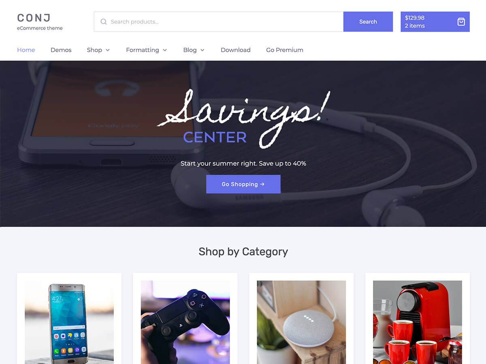

# Conj Lite - eCommerce WordPress Theme
     

<a href="https://wordpress.org/themes/conj-lite/" target="_blank"><kbd></kbd></a>

▬▬▬▬▬▬▬▬▬▬▬▬▬▬▬▬▬▬▬▬▬▬▬▬▬▬▬▬▬▬▬▬▬▬▬▬▬▬▬▬▬

►► If you are not a developer, please use the offical [theme post page](https://wordpress.org/themes/conj-lite/) on wordpress.org.

▬▬▬▬▬▬▬▬▬▬▬▬▬▬▬▬▬▬▬▬▬▬▬▬▬▬▬▬▬▬▬▬▬▬▬▬▬▬▬▬▬

## Installation

* Download the theme from it's GitHub Repository Release window.
* Log into your WordPress website and navigate to **Appearance** » **Themes** » **Add New**.
* Click **Upload Theme** and **Choose File**, then select the theme's `.zip` file. Click **Install Now**.
* Click **Activate** to start using your theme right away.

## Requirements

* PHP version 7.0 or greater.
* MySQL version 5.6 or greater OR MariaDB version 10.0 or greater.
* WordPress version 5.0 or greater.
* WooCommerce version 3.0 or greater.

## Demo

Check out the [Live Demo](https://www.conj.ws/lite) to visit the theme in action.

## Browsers

|  IE / Edge |  Firefox |  Chrome |  Safari |  iOS Safari |  Opera |
| --------- | --------- | --------- | --------- | --------- | --------- |
| IE11, Edge| last 2 versions| last 2 versions| last 2 versions| last 2 versions| last 2 versions

## Translators

Translators are welcome to contribute to the theme. Please use the [WordPress translation website](https://translate.wordpress.org/projects/wp-themes/conj-lite "WordPress translation website").

## Support

If you have any question(s) about using theme, please do not hesitate to check out [support forums](https://wordpress.org/support/theme/conj-lite) and start a new discussion for further assistance or clarification.

## Contributing

We welcome contributions in any form, and you can help reporting, testing, and detailing bugs.

## Go premium

The premium version of this theme is available to purchase from [www.conj.ws](https://www.conj.ws) website. :moneybag: